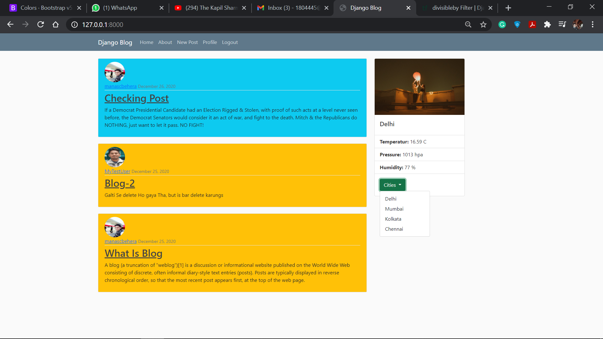
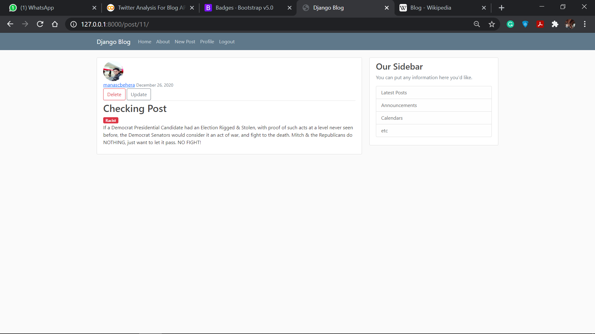
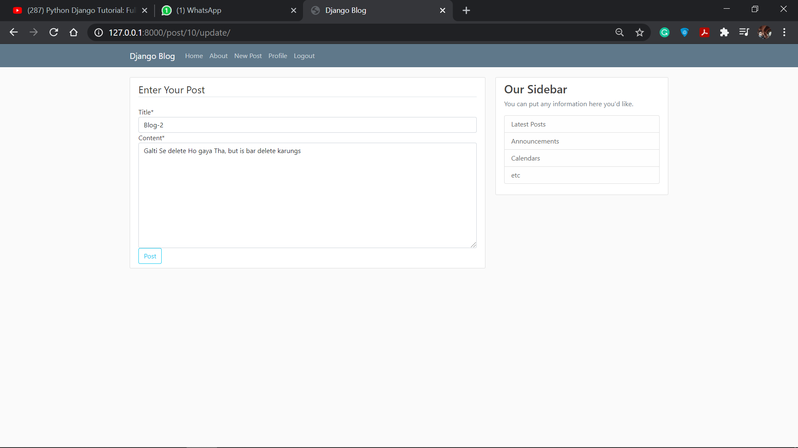

## Blog_APP_Django
Hello Readers, my name is <a href="https://www.linkedin.com/in/manas-chandan-behera-803590199/">Manas Chandan Behera</a>.
 This is a personal Project of blogging application mine which I made by following the turotrial of <a href='https://www.youtube.com/playlist?list=PL-osiE80TeTtoQCKZ03TU5fNfx2UY6U4p'>Corey Schafers Django Playlist</a> and some additional NLP deatures from my side . 
 My Project of blogging app has following features : (a) Login/Logout (b) Register New User (c) Update User Profile (d) New Post by User (e) <strong> Emotion detection for blog </strong> (f) <strong> Weather and Photo deatails for four city using API </strong> (g) Post visit of other users (h) Blog update and delete by user . 
  Have a look : 
<ul>
    <li>The Front page will look like this :   This is a simple UI(Currently Logged In) where the user can see the blogs of various other user, along with weather details of one city which can be changed by a dropdown.</li> 
    <li>The post written by the user can be deleted or updated and also defines the sentiments of the Blog .    The emotion is detected by a NLP model created with the sklearn library(Multinomial Naiye Bayes) that uses the tfidf vectoriser for vectorising the text. Have a <a href="https://www.kaggle.com/manascbehera123/nlp-using-tfidf-and-naive-bayes-simple-96-acc">look</a>. And for post updates, special care has been taken,that the owner of the post can delete or update the post. No other user can do so.</li> 
    <li>If the user clicks on the update button then following screen appears, and the user can update the post </li> 
    <li>The user can log out from the application also: </li>
     
    <li>Each And every user and their related updates are backed by the Django database and the Django views.</li>
    <li>Have a look at the complete <a href="https://drive.google.com/file/d/1rND1uYYB0KMIw9hwnPusBkO1B5tLyoot/view?usp=sharing">Video</a>.</li>
</ul>
  Hope you like it. <strong>Thank You !</strong>