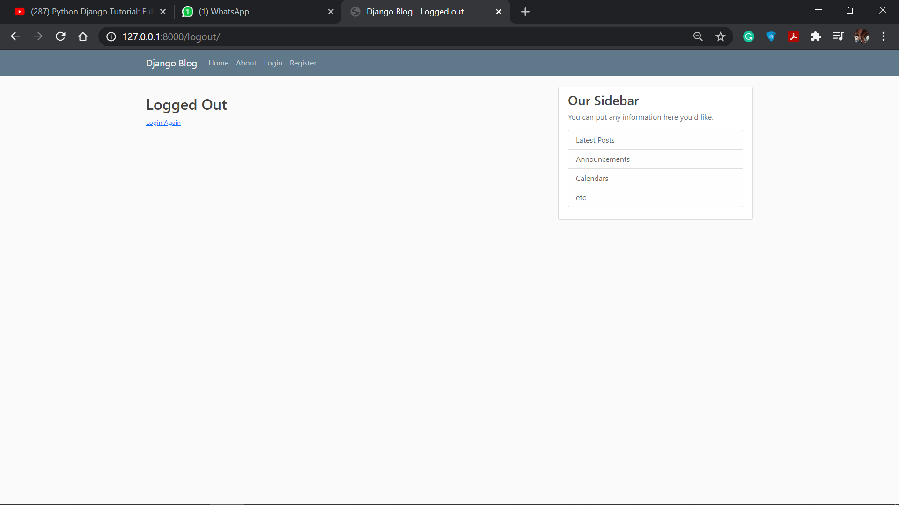

## Blog_APP_Django
Hello Readers, my name is <a href="#">Manas Chandan Behera</a>.
 This is a personal Project of blogging application mine which I made by following the turotrial of <a href='#'>Corey Schafers Django Playlist</a>
 My Project Has following features : 
<ul>
    <li>The Front page will look like this :   This is a simple UI(Currently Logged In) where the user can see the blogs of various other users.</li> 
    <li>The post written by the user can be deleted or updated  For this special care has been taken,that the owner of the post can delete or update the post. No other user can do so.</li> 
    <li>If the user clicks on the update button then following screen appears, and the user can update the post </li> 
    <li>The user can log out from the application also: </li>
     
    <li>Each And every user and their related updates are backed by the Django database and the Django views.</li>
</ul>
  Hope you like it. <strong>Thank You !</strong>